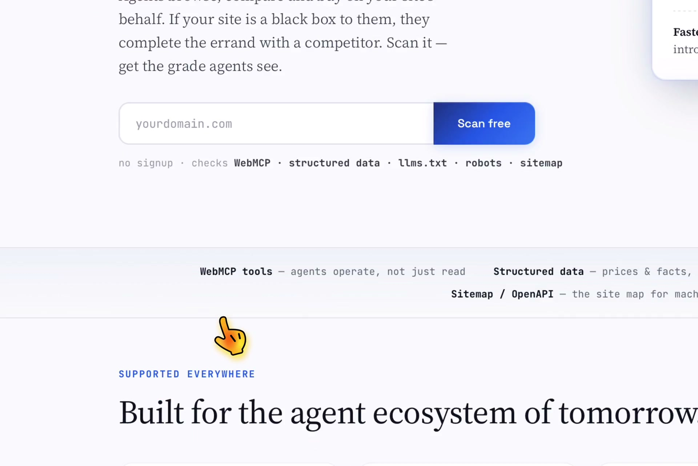

# ToolFront

**Is your website a glass box or a black box to AI agents?**

ToolFront scans any public website for *agent-readiness* — can AI agents (ChatGPT, Claude, browser agents) reliably read, understand, and operate your site? Free, instant, no signup.

## Demo

[](assets/demo-video.mp4)

*Click to watch: scanning a real DTC brand site in 60 seconds*

## What it checks (100-point score)

| Check | Max | What it means for you |
|---|---|---|
| WebMCP tools | 20 | Native tools registered for agents (declarative + imperative + platform injection) |
| **Tool surface security** | 10 | Poisoning audit: zero-width characters, instruction patterns, encoded instruction blobs, exposure — mapped to W3C WebMCP §6.3 and OWASP ASI02 |
| Structured data | 20 | JSON-LD + OpenGraph — agents can extract facts reliably |
| llms.txt | 15 | The cheapest agent-readiness win: one markdown file |
| AI crawler policy | 10 | robots.txt policy for GPTBot / ClaudeBot / … |
| Machine-readable surfaces | 25 | sitemap.xml + openapi.json |

## Architecture

One Cloudflare Worker (`worker.js`), **zero npm runtime dependencies**, one domain:

```
toolfront/
├── worker.js       # scan API + waitlist + static assets
├── public/         # bilingual landing page, privacy/security/terms, self-hosted fonts
└── tests/          # poison-sample suite (36 assertions)
```

**Security posture** (16 red/blue hardening rounds, 0 known exploitable vulnerabilities):
- SSRF gate: DoH resolves A+AAAA *before* any fetch; every IP checked against private/CGNAT/link-local ranges; fail-closed; redirects followed manually with per-hop re-validation
- Rate limiting: official Rate Limiting binding (30/min/IP) + bounded in-memory fallback
- Uniform anti-enumeration responses; per-IP quotas; honeypot fields
- CSP (`default-src 'self'`), nosniff, no-store, Referrer-Policy on every response
- DOM-construction rendering (dynamic data never enters HTML source text); self-hosted fonts (zero third-party requests)
- Scanner opt-out honored (explicit robots.txt ban of our UA)

## Known limitations

**Self-scan.** A Cloudflare Worker cannot fetch its own zone: the request
never leaves the edge and comes back as 522, so scanning `toolfront.dev`
would always report "unreachable". For our own domain the scanner therefore
reads the published assets in `public/` and runs the *identical* checks — the
result is labelled with `self: true` so its provenance is never ambiguous.

Caveat: if a Cloudflare-level feature ever rewrites a response (for example
content-signals replacing `/robots.txt`), the asset-based result could diverge
from what the public receives. `tests/dogfood.test.mjs` re-scores `public/`
from disk with the production check functions, so the self-score stays
auditable without a network call.

Any **third party** scanning toolfront.dev takes the normal network path and
is unaffected by this special case.

## Local development

```bash
npm install
npm run dev            # http://localhost:8787
curl "http://localhost:8787/api/scan?domain=example.com"
```

## Deploy

```bash
npx wrangler deploy
```

Optionally bind a KV namespace as `KV` for a 24h scan cache + waitlist storage.

## Tests

```bash
npm test   # poison-sample suite: every known malicious tool-surface pattern caught, zero false positives on benign samples
```


## Supply-chain posture

- **Production: zero runtime dependencies** → `npm audit --omit=dev` reports **0 vulnerabilities**. The deployed Worker bundles only `worker.js` and its `src/` modules; nothing from `node_modules` ships to production.
- **Development: known CVEs accepted (documented).** `npm audit` reports inherited issues in `sharp`/`libvips` (CVE-2026-33327/33328/35590/35591) pulled in transitively by `wrangler`. Fixing them requires `npm audit fix --force`, which upgrades wrangler to v4 and changes the `[[unsafe.bindings]]` syntax our Rate Limiting binding depends on — a silently-broken limiter is a worse outcome than a dev-only CVE. These packages never reach the deployed Worker (they only run on the developer machine), and none of our code processes untrusted images.

## License

Apache 2.0 — see [LICENSE](LICENSE).
